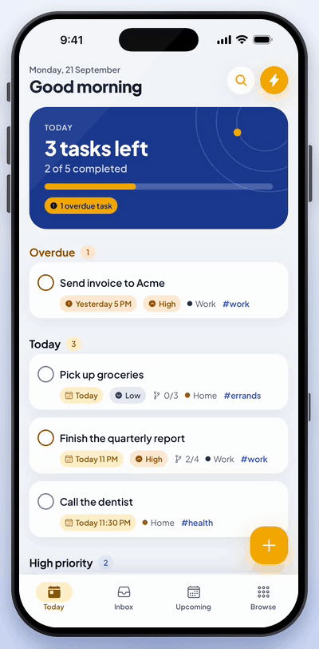
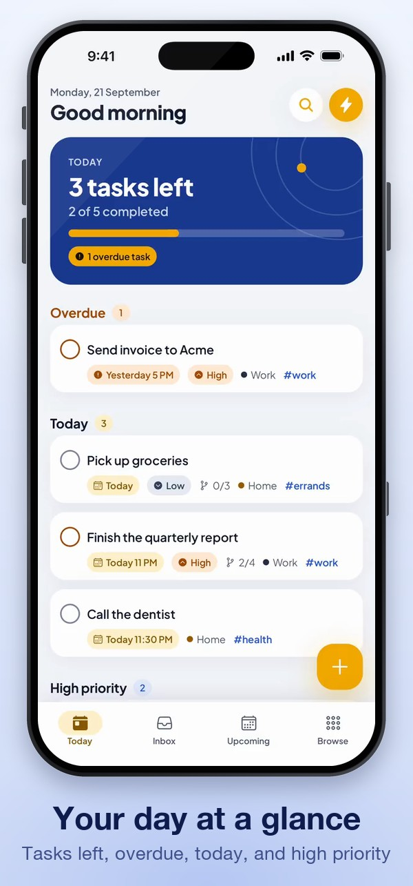
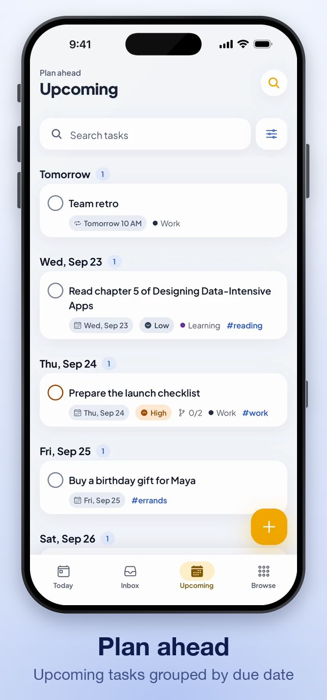
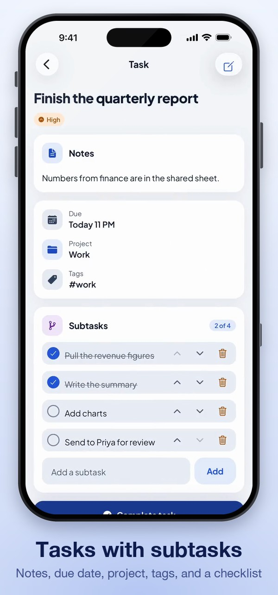
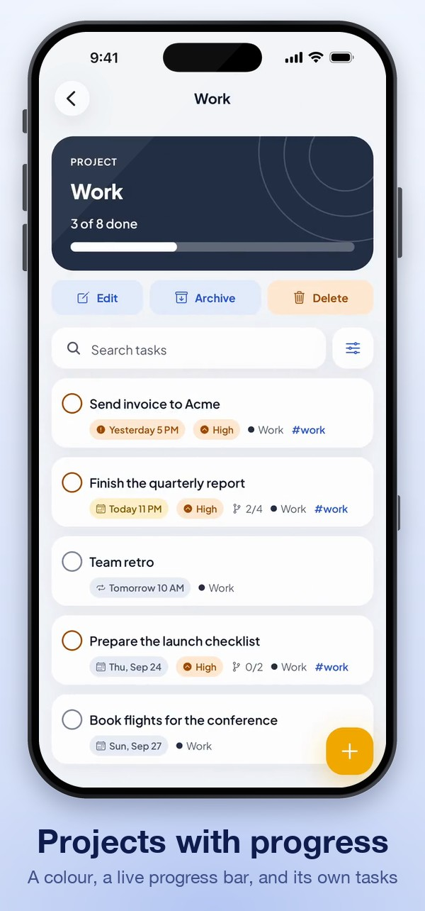
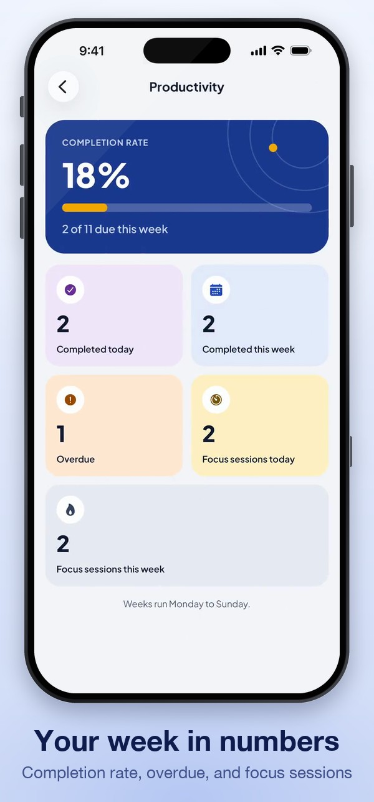
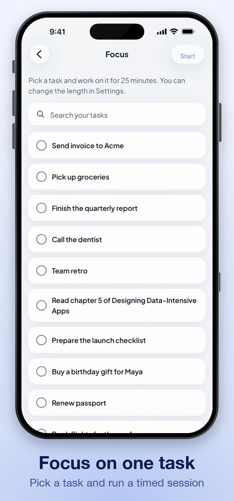

<a name="top"></a>

<div align="center">

# ✅ TaskNama

### A local first task manager that works fully offline

TaskNama is a mobile app for planning your day without an account, a backend, or a network
connection. Capture a task in one sentence, sort it into projects and tags, break it into
subtasks, set reminders and repeats, and run a focus session on whatever is next. Everything is
stored on the device, so data survives a restart, a background kill, and a reboot, and the first
frame of every screen already shows real data.

<p>
  
  
  
  
  
  
  
</p>

**[Walkthrough](#preview)** · **[Key features](#key-features)** · **[Architecture](#architecture)** · **[Getting started](#getting-started)**

</div>

---

<details>
<summary><strong>Table of contents</strong></summary>

- [Preview](#preview)
- [Screens](#screens)
- [About the project](#about-the-project)
- [Key features](#key-features)
- [Built with](#built-with)
- [Architecture](#architecture)
- [Engineering notes](#engineering-notes)
- [Behaviour decisions](#behaviour-decisions)
- [Getting started](#getting-started)
- [Project status and scope](#project-status-and-scope)
- [Roadmap](#roadmap)
- [About the developer](#about-the-developer)
- [License](#license)

</details>

---

## Preview

<p align="center">
  
</p>

<p align="center">
  ▶️ <strong><a href="https://github.com/parvej-brur/tasknama/raw/main/assets/readme/preview.mp4">Watch the full walkthrough (MP4)</a></strong>
</p>

The walkthrough runs through Today, Inbox, Upcoming, Browse, a task with subtasks, All tasks,
a project, Productivity, Focus, and Settings. The footage and the screens below were recorded
on an iPhone 17 Pro Max simulator with demo data, then placed inside a rendered iPhone frame.
The frame is a mockup of the device, not a capture from real hardware.

<p align="right"><a href="#top">Back to top</a></p>

---

## Screens

<table align="center">
  <tr>
    <td align="center"></td>
    <td align="center"></td>
    <td align="center"></td>
  </tr>
  <tr>
    <td align="center"></td>
    <td align="center"></td>
    <td align="center"></td>
  </tr>
</table>

Every screen shares the same design tokens, so the cards, chips, and progress bars read as one product.

<p align="right"><a href="#top">Back to top</a></p>

---

## About the project

TaskNama is a personal task app built around one rule: the phone is the source of truth.
There is no sign up, and nothing in the app waits on a request, so it opens instantly and behaves
the same on a plane as it does on Wi-Fi. An optional cloud backup to your own Supabase project
can be switched on with two environment variables; without them the app never touches the network. The interface is organised around four
daily destinations, Today, Inbox, Upcoming, and Browse, and everything else sits one tap
inside Browse.

The work that matters here is in the layers under the screens. State is a set of Redux slices
that persist to MMKV one record at a time, dates are stored as local calendar strings so they
cannot drift across time zones, untrusted data is coerced on the way in, and the domain logic
(recurrence, reminder planning, the quick add parser, the focus timer, analytics, backup
migrations) is plain TypeScript with no React and no I/O, which is where nearly all of the
tests point.

The project started as a take home assessment for ShareViral. It is kept here as a portfolio
piece that shows a feature folder architecture with a lint enforced dependency boundary, a
storage layer that writes only what changed, and a deliberately small and honest scope.

<p align="right"><a href="#top">Back to top</a></p>

---

## Key features

| Area                      | What it does                                                                                                                                                              |
| ------------------------- | ------------------------------------------------------------------------------------------------------------------------------------------------------------------------- |
| **Tasks**                 | Title, notes, priority, due date and time, project, tags, subtasks, reminder, and repeat. Validated on entry, with an Undo snackbar after delete.                          |
| **Today dashboard**       | "N tasks left" up top, then Overdue, Due today, and High priority sections, with a progress bar for the day.                                                              |
| **Inbox and Upcoming**    | Inbox holds active tasks that have no project yet. Upcoming groups active tasks by due date, soonest first.                                                                      |
| **Projects**              | Create, edit, archive, restore, and delete, with a colour and a live "3 of 8 done" progress bar. Deleting a project un-assigns its tasks instead of deleting them.        |
| **Tags**                  | Free form tags with their own list and detail screens. Add `#tags` while typing a task.                                                                                   |
| **Subtasks**              | Add, edit, complete, delete, and reorder inside a task, with progress shown on the row.                                                                                   |
| **Search, filter, sort**  | One debounced (250 ms) search that composes with status, priority, project, tag, and due filters, and sorts by due date, priority, created, or updated time.              |
| **Recurring tasks**       | Daily, weekly on chosen days, monthly on a day, or every N days, weeks, or months. Completing one creates the next occurrence.                                            |
| **Reminders**             | At due time, 10 minutes, 1 hour, or 1 day before, or a custom moment. Scheduled locally, with permission asked when the first reminder is set.                            |
| **Quick add**             | Type "call Sam every friday at 5pm #work !high" and the date, time, repeat, tag, and priority are pulled out live. Each piece can be switched off before saving.          |
| **Deep links**            | `tasknama://task/<id>` opens a task, and tapping a reminder notification lands on the same screen.                                                                     |
| **Focus mode**            | A timer on one task, with pause, resume, and stop. It survives the app being killed, and a session that ended while closed is completed on the next launch.               |
| **Productivity**          | Completed today and this week, the weekly completion rate, overdue count, and focus minutes.                                                                              |
| **Backup**                | Export everything to a JSON file and import it back. Every record is validated, and older backup versions are migrated forward.                                           |
| **Cloud backup**          | Optional. Upload a copy to your own Supabase project and restore it later. Off until you add a URL and key, and the device stays the source of truth.                    |
| **Appearance**            | System, light, and dark themes on a cobalt and marigold palette, with defaults for reminders and focus length.                                                            |
| **Accessibility**         | Roles and labels on every control, status carried by icon and text as well as colour, reduced motion respected, and a contrast test that fails the build on a bad pair.  |

<p align="right"><a href="#top">Back to top</a></p>

---

## Built with

| Choice                                  | Reason it is here                                                                                                                                  |
| --------------------------------------- | -------------------------------------------------------------------------------------------------------------------------------------------------- |
| **Expo SDK 54 and React Native 0.81**   | The new architecture is on, and Expo Router gives typed, file based routes and deep links for free.                                                 |
| **TypeScript `strict`**                 | The type system is the main safety net in the project, so it is turned up fully.                                                                    |
| **Redux Toolkit**                       | One slice per feature, pure reducers, and thunks for the side effects. Immer keeps unchanged records referentially equal, which the storage layer uses. |
| **react-native-mmkv**                   | Synchronous reads and writes, so the store hydrates before the first render and no screen needs a loading gate.                                     |
| **@shopify/flash-list**                 | Recycled rows for lists that stay smooth at thousands of tasks.                                                                                     |
| **chrono-node**                         | Natural language date and time parsing behind quick add.                                                                                            |
| **expo-notifications**                  | Local reminders and the focus timer end alert. No push server is involved.                                                                          |
| **React Compiler**                      | Automatic memoization, so screens carry no hand written `useMemo` or `useCallback`.                                                                 |
| **Jest with jest-expo**                 | Fast unit tests over the pure domain modules, with no native mocks needed for most of them.                                                         |

Server state libraries and an ORM were left out on purpose. There is no server, and a slice
per feature persisted key by key covers everything the app needs.

<p align="right"><a href="#top">Back to top</a></p>

---

## Architecture

Screens read from selectors, dispatch thunks, and never touch storage. The store is the only
thing that talks to MMKV, and it does so through one persistence subscriber.

```
Screens (src/features/*/screens, rendered by src/app routes)
        │  useAppSelector / useAppDispatch
        ▼
Selectors and thunks         pure derivations, and actions that also schedule
        │                    reminders or show an Undo snackbar
        ▼
Redux slices                 tasks, projects, tags, focus, settings
        │  store.subscribe
        ▼
src/lib/store/persistence    diffs each slice, writes only the records that changed
        │
        ▼
src/lib/storage              typed key value backend over MMKV, one key per record
```

- **The store hydrates synchronously.** MMKV reads are synchronous, so the store is filled
  when the module loads and the first frame already shows real data. There is no splash
  gated fetch and no loading spinner.
- **One key per record.** Records live under `task:<id>`, `project:<id>`, and so on. Immer
  keeps unchanged records referentially equal, so after each action only the records that
  changed are written and deleted ones are removed. Editing one task does not rewrite the rest.
- **Untrusted data is coerced on entry.** Each feature has a `schemas.ts` that turns stored or
  imported JSON into a valid record or rejects it. A record that cannot be parsed is skipped,
  never fatal, and the user is told once.
- **Domain logic has no React and no I/O.** Dates, validation, recurrence, the reminder
  planner, the quick add parser, the focus timer, analytics, and backup migrations are plain
  functions, which keeps them fast to test and easy to reason about.
- **The feature boundary is enforced.** Routes reach a feature only through its `index.ts`,
  shared components never import a feature, and nothing below the route layer imports a
  screen. ESLint checks this, it is not left to discipline.

<p align="right"><a href="#top">Back to top</a></p>

---

## Engineering notes

A few decisions worth calling out for anyone reading the code:

- **Redux slices over Context, and no query library.** The app has several related pieces of
  state (tasks, projects, tags, focus, settings) that reference each other, and deleting a
  project has to un-assign its tasks. Slices with `extraReducers` express that in one place,
  and there is no server to cache, so a data fetching library would have nothing to do.
- **MMKV with a diffing persistence layer.** A subscriber compares each slice with its
  previous value and writes only the records whose reference changed, so a keystroke in one
  task never rewrites a thousand others. No `redux-persist` is needed.
- **Dates are strings, not instants.** Due dates are local `YYYY-MM-DD` and times are
  `HH:mm`. "Due Friday" stays Friday across time zones and daylight saving changes, and
  comparing two dates is a string comparison.
- **Undo restores the same record.** Delete keeps the full task in the snackbar callback and
  puts back the same id, subtasks included. Completing a recurring task also creates the next
  occurrence, and its Undo removes that occurrence too.
- **A pure reminder planner.** It picks the next 50 upcoming reminders, since iOS caps pending
  notifications at 64, and a diff turns that into the minimum cancel and schedule calls. It
  runs at start, on foreground, and, debounced, after task changes. Permission is requested
  when the first reminder is set, not on launch.
- **Focus state is a timestamp.** The session stores `endsAt`, or `remainingMs` when paused,
  and the countdown is computed from that on every tick, so a slow render never makes the
  timer drift. The end notification is scheduled on start and resume, and cancelled on pause
  and stop.
- **Memoization is left to the compiler.** React Compiler is on, so screens carry no
  `useMemo` or `useCallback`. `React.memo` is used only on `TaskRow`, the one component every
  list repeats, and it receives primitives, the task record, and stable callbacks.
- **Colour is never the only signal.** The palette has no red, green, or teal. Overdue is
  burnt orange, completed is plum purple, and each status also carries an icon or a label.
  `contrast.test.ts` checks every text pair against WCAG AA and guards the hue rules.

<p align="right"><a href="#top">Back to top</a></p>

---

## Behaviour decisions

Small product rules that are easy to miss and are covered by tests where it matters:

- **Overdue is time aware.** A task due today at 9 AM is overdue at 10 AM.
- **"At due time" with no time set fires at 09:00.**
- **Archived projects** hide their tasks from Inbox, Today, and Upcoming, and hide the
  project from pickers. The tasks stay reachable inside the project once it is restored, and
  their reminders still fire.
- **Today's "High priority" section** lists other active high priority tasks, meaning ones
  not already under Overdue or Due today.
- **Custom "every N months"** anchors to the previous due date, so Jan 31 becomes Feb 28 and
  then Mar 28. "Monthly on day 31" does not drift.
- **Import is strict and forgiving at once.** Every record is validated, unreadable or
  duplicate ones are counted and skipped, references to missing projects or tags are dropped,
  and a running focus session is never restored. Files from a newer app version are refused,
  and older ones are migrated.
- **The focus completion prompt** survives an app kill through an `acknowledged` flag.

<p align="right"><a href="#top">Back to top</a></p>

---

## Getting started

**Prerequisites:** Node 20 or newer and npm. For iOS, macOS with Xcode 16 or newer and
CocoaPods. For Android, Android Studio with an emulator, or a device with USB debugging.

MMKV, notifications, the date picker, and the document picker are native modules, so the app
runs in a **development build**, not Expo Go.

```bash
git clone https://github.com/parvej-brur/tasknama.git
cd tasknama
npm install
npx expo run:ios       # or: npx expo run:android
```

The first run generates the native projects and launches the dev build. After that, the normal
dev server is enough:

```bash
npx expo start
```

### Routes

| Route                                  | Screen                                                     |
| -------------------------------------- | ---------------------------------------------------------- |
| `/` (tab)                              | Today dashboard                                            |
| `/inbox`, `/upcoming`, `/browse` (tabs) | Inbox, Upcoming, and the Browse hub                        |
| `/task/new`, `/task/[id]`, `/task/edit/[id]` | Create, view, and edit a task. `[id]` is the deep link target |
| `/quick-add`                           | Natural language capture                                   |
| `/tasks/all`, `/completed`             | Search, filter, and sort across everything, and finished work |
| `/project/new`, `/project/[id]`, `/projects/archived` | Projects, their detail, and the archive        |
| `/tags`, `/tag/[id]`                   | Tags and the tasks under one tag                           |
| `/focus`, `/productivity`, `/settings` | Focus timer, weekly stats, and preferences                 |

### Scripts

| Command             | Purpose                                     |
| ------------------- | ------------------------------------------- |
| `npm start`         | Start the Expo dev server                   |
| `npm run ios`       | Build and run the iOS dev build             |
| `npm run android`   | Build and run the Android dev build         |
| `npm test`          | Run the Jest unit tests                     |
| `npm run typecheck` | Type check with `tsc --noEmit`              |
| `npm run lint`      | Lint with ESLint, including boundary rules  |
| `npm run format`    | Format with Prettier                        |
| `npm run verify`    | Lint, type check, and test in one go        |

EAS build profiles for `development`, `preview`, and `production` are in
[`eas.json`](eas.json).

<p align="right"><a href="#top">Back to top</a></p>

---

## Project status and scope

The app is complete for what it sets out to do, and a few things are deliberately left out:

- **No accounts, and no live sync.** Data lives on one device. Cloud backup is a manual upload or
  restore of a whole copy, not a merge between devices, and it is not per user: anyone with your
  project URL and anon key can read it. Export and import work without any backend.
- **No collaboration, attachments, location reminders, calendar sync, or widgets.**
- **No AI services and no gamification.**
- **Subtasks reorder with up and down buttons.** There is no drag and drop.
- **No component or screen tests.** The pure domain code is covered, and the screens are
  checked by running the app and by the Maestro smoke flow.

<p align="right"><a href="#top">Back to top</a></p>

---

## Roadmap

- Add React Native Testing Library coverage for the task form and the list screens.
- Add drag and drop reordering for subtasks.
- Add an optional home screen widget for Today.
- Add Supabase Auth and per-user row policies, then merge based sync between devices.

<p align="right"><a href="#top">Back to top</a></p>

---

## About the developer

Built by **Parvej Sikdar**.

- Portfolio: [agriyo.netlify.app](https://agriyo.netlify.app)
- GitHub: [@parvej-brur](https://github.com/parvej-brur)

I designed the architecture, the storage model, and the behaviour rules. I used Claude to
scaffold repetitive UI, draft unit tests, and write this documentation. I reviewed the
implementation and checked it with `npm run verify` before committing.

<p align="right"><a href="#top">Back to top</a></p>

---

## License

This project is a portfolio piece. The code is available for reading and reference. Please ask
before reusing a substantial part of it in another project.

<p align="right"><a href="#top">Back to top</a></p>
